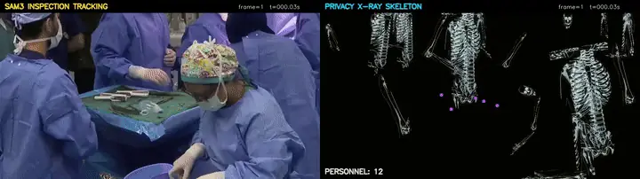
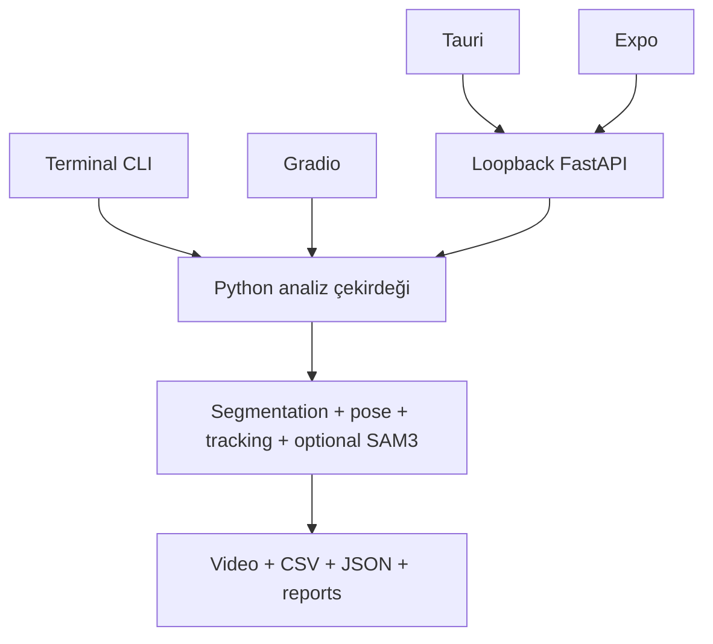

# Cerrahi Alet Instance Segmentation ve İzleme

Bu repository, masa üstünü gören cerrahi videolarda alet instance segmentation, tracking, sağlık personeli pose analizi ve mahremiyet odaklı sentetik X-ray çıktıları üretir. CLI, Gradio, Tauri ve Expo istemcileri aynı Python analiz çekirdeğini kullanır; masaüstü ve mobil istemciler FastAPI sözleşmesi üzerinden bağlanır.

[](https://github.com/ahmetkiyran/surgery-instrument-instance-segmentation-v1/actions/workflows/tests.yml)
[](LICENSE)

> **Klinik ve privacy uyarısı:** Tespit edilmemek klinik kullanım, cerraha teslim, doku teması veya hastada kalma kanıtı değildir. Skeleton/X-ray çıktısı kaynak RGB'yi kaldırsa da tam anonimlik garanti etmez. Bu proje klinik karar verme, cerrahi sayım veya üretim güvenliği sistemi değildir.

## Demo



Bu animasyon, yetkili `tracking_xray_comparison_first_minute.mp4` kaynağının ilk 60 saniyesinden üretilmiş gerçek SAM3/CUDA/checkpoint çıktısıdır; sentetik fixture değildir. Sol panel SAM3 inspection tracking'i, sağ panel privacy-Xray skeleton çıktısını gösterir. Bir cerrahi alet ile iki sağlık personeli farklı zamanlarda seçilerek izlenmiştir.

Demo WebP yaklaşık 60 saniye, 720×202, 8 FPS, 480 frame ve 9,14 MiB boyutundadır; ses içermez. Person 1 akışında kayıp takip frame'leri bulunduğu için kesintisiz klinik tracking iddiası yoktur.

**Hassas içerik uyarısı:** Inspection paneli gerçek klinik ortamı ve sağlık personelini içeren kaynak RGB kareleri gösterebilir. Örnek karelerde hasta görüntüsü, okunabilir klinik belge veya kurum bilgisi görülmedi; yine de demo tamamen anonim kabul edilmemelidir. Yayın ve yeniden kullanım için kurum izni, etik değerlendirme ve gerekli onam süreçleri kullanıcı sorumluluğundadır.

## Özellikler

- Health-personnel ve cerrahi alet instance segmentation.
- BoT-SORT/ByteTrack tracking ve sınıf/instance süre raporları.
- COCO-17 pose, iskelet-only ve kaynak-türevli blur akışları.
- Gerçek kaynak görüntüsünde seçilmiş hedef inspection'ı.
- Kaynak RGB almayan sentetik privacy-Xray renderer; isteğe bağlı vendor renderer veya clean-clone builtin skeleton fallback.
- `legacy`, `inspection`, `privacy-xray` ve `dual` render modları.
- CLI, Gradio, loopback FastAPI, Tauri masaüstü ve Expo mobil istemcileri.
- SHA-256, task ve class metadata doğrulamalı model manifesti.
- Session'a özel çıktılar, containment kontrollü artifact endpoint'leri ve upload limitleri.

## Pipeline mimarisi



`PipelineConfig`, `ModelConfig`, `Detection`, `Track`, `UnifiedTrack`, `FrameAnalysis`, `SelectionEvent`, `RenderConfig`, `ArtifactManifest` ve `SessionState` ortak sözleşmelerdir. Model yolları CLI/config/environment üzerinden değiştirilebilir; class mapping ve çıktı klasörü tek bir cerrahi pipeline adına sabitlenmez.

Render modları:

- `legacy`: Mevcut v1 akışını ve çıktıları korur.
- `inspection`: Seçilmiş SAM3 hedeflerini kaynak RGB üzerinde gösterir; hassas kabul edilmelidir.
- `privacy-xray`: Renderer'a kaynak RGB vermez; sentetik iskelet/X-ray üretir.
- `dual`: Sol panel inspection, sağ panel privacy-Xray olacak şekilde iki çıktıyı aynı analizden üretir.

## Gereksinimler

- Python `>=3.11,<3.13`.
- FFmpeg ve FFprobe.
- En az 16 GB RAM önerilir; CUDA uyumlu NVIDIA GPU önerilir, CPU kullanılabilir ancak daha yavaştır.
- Tauri için Node.js, npm, Rust stable ve Windows WebView2/build araçları.
- Mobil için Expo'nun desteklediği Node sürümü, Android SDK/JDK; telefonda inference çalışmaz.
- SAM3 için ayrıca resmi vendor paketi, uyumlu PyTorch/CUDA ve doğrulanmış checkpoint gerekir.

Base `requirements.txt` CUDA veya SAM3 vendor kurulumuna sabitlenmez. SAM3, Tauri ve Expo bağımsız opsiyonlardır; kurulmamış olmaları legacy/base akışını bozmaz.

## Temiz klon ile hızlı başlangıç

### Windows

```powershell
git clone https://github.com/ahmetkiyran/surgery-instrument-instance-segmentation-v1.git
cd surgery-instrument-instance-segmentation-v1
powershell -ExecutionPolicy Bypass -File .\scripts\setup_windows.ps1
powershell -ExecutionPolicy Bypass -File .\scripts\start_windows.ps1
```

### Linux

```bash
git clone https://github.com/ahmetkiyran/surgery-instrument-instance-segmentation-v1.git
cd surgery-instrument-instance-segmentation-v1
bash scripts/setup_linux.sh
bash scripts/start_linux.sh
```

Kurulum scriptleri mevcut kullanıcı dosyalarını silmez, sahte model indirmez ve eksik model/FFmpeg durumunu açıkça bildirir. Temel kontrol:

```powershell
python -m surgical_pipeline doctor --json
python -m surgical_pipeline models verify
```

Linux'ta `python` yerine `python3` veya `.venv/bin/python` kullanın. Gerçek model ağırlıkları yoksa manifestteki offline kurulum talimatlarını izleyin; placeholder ağırlık kullanılmaz.

## İsteğe bağlı SAM3 kurulumu

SAM3 base kurulumdan ayrıdır. Vendor repository ve Python yorumlayıcısını kendi kurulumunuza göre environment değişkenleriyle bağlayın:

```powershell
$env:SAM3_REPO_PATH = Join-Path $env:USERPROFILE 'sam3tracking'
$env:SAM3_MODEL_PATH = Join-Path $env:SAM3_REPO_PATH 'models\sam3.pt'
$env:SAM3_CONFIG_PATH = Join-Path $env:SAM3_REPO_PATH 'configs\default.yaml'
$env:SAM3_PYTHON_PATH = Join-Path $env:SAM3_REPO_PATH '.venv-sam3\Scripts\python.exe'
& $env:SAM3_PYTHON_PATH -m surgical_pipeline doctor --sam3 --json
```

Model çözümleme önceliği CLI/config, environment ve doğrulanmış repository-relative varsayılandır. `doctor --sam3` sonucu `ready` değilse `--enable-sam3` ile gerçek propagation başlatılmamalıdır. SAM3 yoksa açık kurulum hatası verilir; legacy/base akışı çalışmaya devam eder.

## Model yönetimi ve doğrulama

Model manifesti [models/model_manifest.json](models/model_manifest.json) içindedir. Kurulumda model durumunu listelemek ve doğrulamak için:

```powershell
python -m surgical_pipeline models list
python -m surgical_pipeline models verify
```

Manifestteki her segmentation modeli SHA-256, Ultralytics task tipi ve beklenen class listesiyle doğrulanır. Bu sürümde yetkilendirilmiş dosyalar `models/weights/health_personnel_segmentation.pt` ve `models/weights/surgical_instrument_segmentation.pt` konumlarındadır; pose modeli `yolo11m-pose.pt` olarak ayrıca doğrulanır. Release yayımlanmadan eksik dosya için sahte veya placeholder indirme yapılmaz. Alternatif model yolları `.env.example`, YAML config veya CLI ile verilebilir; `.env` commit edilmemelidir.

## CLI kullanımı

```powershell
python -m surgical_pipeline --help
python -m surgical_pipeline analyze --help
python -m surgical_pipeline analyze `
  --input ".\video.mp4" `
  --output-dir ".\outputs\legacy" `
  --render-mode legacy `
  --privacy-mode skeleton-only
```

Unified pipeline örnekleri:

```powershell
# Seçilmiş hedefleri gerçek görüntü üzerinde gösterir (SAM3 gerekir)
python -m surgical_pipeline analyze --input .\video.mp4 --output-dir .\outputs\inspection --render-mode inspection --selection-events .\selection_events.json --enable-sam3

# Kaynak RGB almayan sentetik privacy çıktısı
python -m surgical_pipeline analyze --input .\video.mp4 --output-dir .\outputs\privacy_xray --render-mode privacy-xray --enable-xray-skeleton

# Inspection + privacy-Xray
python -m surgical_pipeline analyze --input .\video.mp4 --output-dir .\outputs\dual --render-mode dual --selection-events .\selection_events.json --enable-sam3 --enable-xray-skeleton
```

`--device`, `--no-depth`, tracker, confidence/IoU ve model yolu seçenekleri `analyze --help` içinde listelenir. Kaynak video değiştirilmez veya üzerine yazılmaz; her çalışma session'a özel çıktı klasörüne yazılır.

## Gradio web arayüzü

```powershell
python app.py
```

Arayüz varsayılan olarak `127.0.0.1:7860` üzerinde çalışır ve Gradio share link açmaz. Video yükleyip model durumunu doğrulayın, ayarları seçin ve analizi başlatın. Gradio kaynak-türevli blur çıktısı üretebilir; bu çıktılar hassas kabul edilmeli ve paylaşılmadan önce insan tarafından incelenmelidir.

## Tauri masaüstü uygulaması

```powershell
npm install
npm run typecheck:desktop
npm run build:desktop
npm run tauri --workspace=@surgical/desktop -- dev
```

Native paketleme Rust/Cargo ve WebView2 gerektirir. Bu repository'de hazır `.exe`, `.msi` veya native paket yayımlanmamıştır.

## Expo mobil uygulaması

```powershell
npm install
npm run typecheck:mobile
npm exec --workspace=@surgical/mobile expo export -- --platform android
```

Mobil istemci inference yapmaz; dosyayı Python backend'e yükler. Fiziksel cihazda backend için güvenilir LAN ve en az 32 karakterlik token gerekir. Hazır APK/AAB yayımlanmamıştır; fiziksel Android/iOS testleri bu doğrulamanın kapsamında değildir.

## Etkileşimli hedef seçimi

Gradio, Tauri ve Expo seçimden önce temiz bir preview gösterir. Kullanıcı tıklama/dokunma yaptığında istemci normalized koordinat, görüntülenen alan, kaynak boyutu, frame ve timestamp ile seçim olayını gönderir. Letterbox dışındaki koordinatlar reddedilir. Backend seçim olayını hemen session'a kaydeder; ağır SAM3 propagation yalnızca kullanıcı analizi başlattığında, tüm olay listesiyle bir kez çalışır. Bu sayede timeline üzerinde farklı zamanlarda hedef eklemek her istemcide aynı davranışı verir.

## Çıktılar ve artifact formatları

Legacy/blur akışlarında `processed_video.mp4`, `analysis.json`, `summary.json`, detection/track CSV'leri, görünürlük aralıkları, grafikler, HTML raporları ve ZIP paketleri üretilir. Skeleton-only akışı kaynak RGB ve ses taşımayan sentetik video, pose/instrument CSV'leri, privacy raporu ve manifest üretir.

Unified dual akışında tipik çıktılar:

- `sam3_inspection.mp4` (kaynak RGB içerebilir; hassas),
- `processed_video_xray_sam3.mp4` (sentetik privacy-Xray),
- `selection_events.json`, `events.json`, `summary.json`, `quality_report.json`, `privacy_report.json`,
- track CSV'leri, `run_config.yaml` ve hash içeren `run_manifest.json`.

Public artifact response'larında kullanıcı makinesinin absolute path'i tutulmaz. Privacy renderer'ın kaynak RGB kabul etmediği manifestte belirtilir.

Rapor metrikleri birbirinden ayrıdır: `union_usage_seconds` bir sınıfta en az bir doğrulanmış track'in görünür olduğu birleşik aralıktır; `instance_time_seconds` ayrı track sürelerinin toplamıdır; `not_visible_seconds` işlenen zaman çizelgesinde sınıfın görünür olarak tespit edilmediği aralıktır. Occlusion, düşük mask recall, kadraj ve takip kopması bu değerleri etkileyebilir.

## Testler ve doğrulama durumu

Son yerel doğrulama:

| Kontrol | Sonuç |
| --- | --- |
| Python testleri | `64 passed, 1 skipped` |
| Atlanan test | Yetkili, yayımlanmış GitHub Release ve izinli smoke video gerektiren opt-in test |
| Ruff | Başarılı |
| `pip check` | Başarılı |
| API client typecheck | Başarılı |
| Desktop typecheck | Başarılı |
| Mobile typecheck | Başarılı |
| Desktop production/web build | Başarılı |
| Expo Android export | Başarılı |
| Base/legacy doctor | Başarılı |
| Gerçek SAM3 doctor | `ready` |
| Gerçek SAM3/CUDA/checkpoint preflight ve ilk 60 saniye demo | Başarılı |
| Temiz clone base kurulumu ve CLI smoke testleri | Başarılı |
| Uzun video, klinik doğrulama | Yapılmadı |
| Native Tauri paketleme | Cargo/Rust yoksa doğrulanmadı |
| Fiziksel Android/iOS cihaz testi | Yapılmadı |

Yerelde tekrarlamak için:

```powershell
python -m pytest -q
python -m ruff check .
python -m pip check
python -m surgical_pipeline doctor --json
npm run typecheck:api-client
npm run typecheck:desktop
npm run typecheck:mobile
npm run build:desktop
npm exec --workspace=@surgical/mobile expo export -- --platform android
```

Bu sonuçlar teknik smoke/contract doğrulamasıdır; klinik performans veya üretim uygunluğu anlamına gelmez.

## Sorun giderme

- `doctor` model/FFmpeg hatası verirse model manifestini, dosya hash'lerini ve FFmpeg PATH'ini kontrol edin.
- CUDA belleği yetmezse `--device cpu`, `--no-depth` veya daha küçük inference ayarlarını deneyin.
- SAM3 hatasında önce `doctor --sam3 --json` çıktısının `ready` olduğunu doğrulayın.
- Tauri native komutları Cargo bulunamadığını bildirirse Rust stable ve WebView2/build araçlarını kurun.
- Android emulator için backend adresi çoğu kurulumda `10.0.2.2` olur; fiziksel cihazda güvenilir LAN ve güçlü token kullanın.
- Kaynak-türevli video ve logları public paylaşmadan önce içerik ve absolute path denetimi yapın.

## Güvenlik ve veri gizliliği

- `inspection` ve `blur/both` kaynak RGB içerebilir; hassas veri olarak ele alınmalıdır.
- `privacy-xray` renderer'a kaynak RGB verilmez ve ses kopyalanmaz.
- API varsayılan olarak loopback'e bağlanır; LAN modu açıkça etkinleştirilir ve güçlü token ister.
- Upload adı sanitize edilir, session ID UUID'dir, artifact path containment ve upload/süre limitleri uygulanır.
- `shell=True` ve `os.system` üretim yolunda kullanılmaz; FFmpeg çağrıları timeout'lu argüman listeleriyle çalışır.
- `.env`, token, credential, güvenlik raporları, kaynak videolar, cache ve generated output'lar `.gitignore` ile dışarıda tutulur.
- Klinik veri için kurum politikası, KVKK/GDPR, etik kurul ve onam süreçleri ayrıca uygulanmalıdır.

## Bilinen sınırlamalar

- İlk 60 saniyelik gerçek SAM3 denemesi teknik pilot doğrulamasıdır; uzun video işleme ve klinik validasyon yapılmamıştır.
- Person 1 akışında kayıp tracking frame'leri vardır; kesintisiz takip garantisi yoktur.
- Pose ve segmentation hataları görünürlük sürelerini etkileyebilir; göreli 3B sonuçlar kalibre edilmiş gerçek dünya ölçümü değildir.
- Tauri native paketleme, fiziksel Android/iOS ve iOS build testleri bu ortamda doğrulanmamıştır.
- Model ağırlıkları ve vendor SAM3 checkpoint'lerinin dağıtım/lisans hakları kullanıcı tarafından doğrulanmalıdır.

## Üçüncü taraf bileşenler

PyTorch, Ultralytics, OpenCV, Gradio, Tauri, Expo, FFmpeg ve Depth Anything V2 lisans notları [THIRD_PARTY_NOTICES.md](THIRD_PARTY_NOTICES.md) dosyasındadır. Ultralytics ve model ağırlıklarının yeniden dağıtım koşulları kullanım senaryosuna göre ayrıca incelenmelidir.

## Lisans

Kaynak kod [MIT Lisansı](LICENSE) altındadır. Model ağırlıkları ve veri izinleri otomatik olarak MIT kapsamına girmez; dağıtım hakkı ayrıca doğrulanmalıdır.
# Release validation status

The repository provides four client surfaces: the Python CLI, the root Gradio application, the Tauri desktop client, and the Expo mobile client. They share the typed API contracts for sessions, frame metadata, selection events, render modes, jobs, tracks, and artifacts.

Client lifecycle coverage now includes metadata-bounded frame selection, session start, job polling, active-track/artifact retrieval, cancel, and cooperative pause/resume. Tauri interactive selections are sent through `startSession`; mobile upload flows continue through selection and session start. Privacy-Xray preview is a synthetic geometry-only renderer and never receives the source RGB frame.

Product validation commands:

```powershell
python -m pytest -q
python -m ruff check .
python -m pip check
npm run typecheck:api-client
npm run typecheck:desktop
npm run typecheck:mobile
npm run build:desktop
npm exec --workspace=@surgical/mobile expo export -- --platform android
```

The current validation report records exact pass/fail/skip results, clean-clone and first-minute validation status, and the remaining environment-limited native/browser/device checks. The source video, model checkpoint, and audit/security outputs are not repository assets.

GitHub push is a release operation and is not included in the test suite.
## SAM3-style interactive workflow

The interactive workflow mirrors the `sam3tracking` desktop tool across Tauri, Gradio and Mobile: open a session, move to any frame with the timeline/frame control, click a target, and add more targets at later frames. Selection clicks are recorded immediately; the expensive SAM3 propagation starts only after the user presses **Start tracking**. This keeps the UI responsive and makes every selection event reproducible in `selection_events.json`.

Interactive runs use `dual` output by default and retain both products without modifying the source video:

- `sam3_inspection.mp4` / `inspection_tracking.mp4`: source RGB with target IDs and tracking overlays; treat as sensitive.
- `processed_video_xray_sam3.mp4` / `security_xray_final.mp4`: geometry-only synthetic security X-ray, with no source RGB passed to the privacy renderer.
- `tracking_xray_comparison.mp4`: synchronized inspection/X-ray comparison when both outputs are enabled.

The source remains read-only. Session events, masks, tracking CSV/JSON, privacy report and output manifest are stored in the job directory. The security X-ray is the shareable final output; the RGB inspection video is retained for audit and visual verification.
