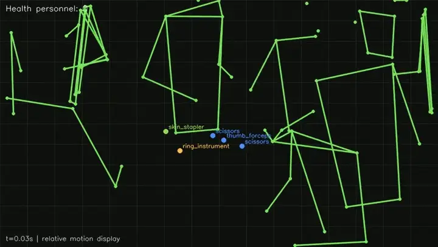
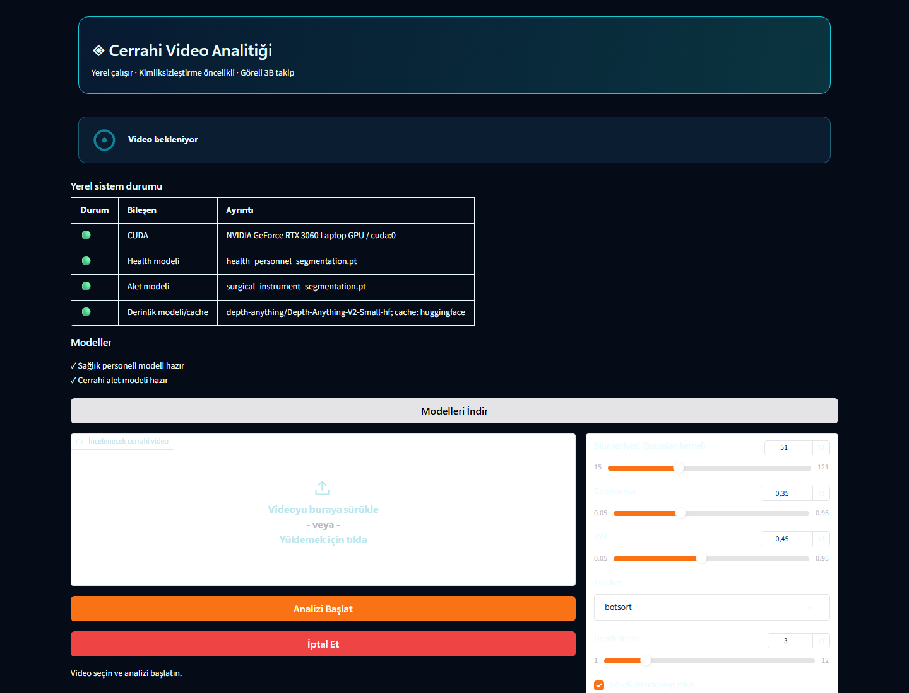
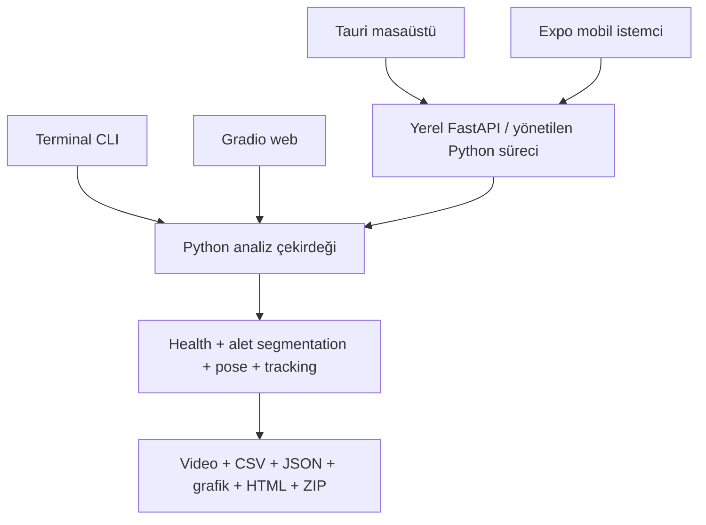

# Cerrahi Alet Instance Segmentation ve İzleme

Bu proje, masa üstünü gören cerrahi videolarda `skin_stapler`, `thumb_forceps`, `ring_instrument` ve `scissors` sınıflarını instance segmentation ve tracking ile takip eder; aletlerin görünür masa üzerinde tespit edilmediği zaman aralıklarını tahmin eder; sağlık personelini kaynak RGB görüntüsü yerine siyah sentetik zemin üzerinde pose iskeleti olarak gösterebilir. Terminal CLI, Gradio, Tauri masaüstü ve Expo mobil istemci aynı Python analiz çekirdeğini kullanır; masaüstü ve mobil istemciler bu çekirdeğe yerel FastAPI üzerinden bağlanır.

[](https://github.com/ahmetkiyran/surgery-instrument-instance-segmentation-v1/actions/workflows/tests.yml)
[](LICENSE)



> [!IMPORTANT]
> **Klinik yorum uyarısı:** Raporlanan süre, aletin görünür masa üzerinde tespit edilmediği tahmini süredir. Aletin klinik olarak kullanıldığını, cerraha verildiğini, dokuya temas ettiğini veya hastada kaldığını kanıtlamaz.
>
> **Mahremiyet uyarısı:** İskelet tabanlı çıktı kaynak RGB görünümünü kaldırarak doğrudan görsel kimlik riskini azaltır; ancak pose hataları, hareket örüntüleri, zamanlama bilgisi ve kaynak tabanlı denetim görselleri nedeniyle tam anonimlik garantisi vermez.
>
> Bu yazılım klinik karar verme veya cerrahi sayım sisteminin yerine geçmez.

## Hızlı başlangıç

Python 3.11 veya 3.12 ve FFmpeg kurulu bir Windows makinede:

```powershell
git clone https://github.com/ahmetkiyran/surgery-instrument-instance-segmentation-v1.git
cd surgery-instrument-instance-segmentation-v1
powershell -ExecutionPolicy Bypass -File .\scripts\setup_windows.ps1
powershell -ExecutionPolicy Bypass -File .\scripts\start_windows.ps1
```

İlk komut yerel `.venv` ortamını hazırlar; sonraki açılışlarda yalnızca `start_windows.ps1` kullanılır. Arayüz `http://127.0.0.1:7860` adresinde açılır.

| Ortam | Giriş noktası | Analiz bağlantısı | Kullanım amacı |
| --- | --- | --- | --- |
| Terminal CLI | `python -m surgical_pipeline` | Doğrudan Python çekirdeği | Otomasyon ve tek video analizi |
| Gradio web | `python app.py` | Doğrudan Python çekirdeği | Yerel tarayıcı arayüzü |
| Tauri masaüstü | `apps/desktop/` | Yönetilen loopback FastAPI | Windows masaüstü istemcisi |
| Expo mobil | `apps/mobile/` | Token korumalı FastAPI | Android/iOS istemcisi; telefonda inference yapmaz |

## Proje özeti

- Health-personnel segmentasyonu, cerrahi alet segmentasyonu, BoT-SORT/ByteTrack ve COCO-17 pose estimation birlikte çalışır.
- `skeleton-only` modu kaynak kareyi renderer'a vermez; yeni bir sentetik kare oluşturur ve sesi kopyalamaz.
- `blur` modu kaynak RGB'den türetilmiş hassas bir çıktı üretir; paylaşmadan önce insan denetimi gerekir.
- `both` modu blur raporlarını ve skeleton çıktısını ayrı çalışma dizinlerinde üretir.
- Görünür tespit süresi, instance-time ve görünür masa üzerinde tespit edilmeyen tamamlayıcı aralıklar ayrı alanlardır.
- Göreli 2B/3B hareket, personel sayımı, CSV/JSON, grafik, HTML ve ZIP çıktıları desteklenir.

## Demo

`docs/assets/demo_skeleton.webp`, gerçek health-personnel, instrument ve pose modellerinin gerçek pipeline çıktısından üretilmiştir. Animasyon 720×406, yaklaşık 9,9 saniye ve 9 FPS'tir. Kaynak RGB kareleri veya ses içermez. Düzenli örnek karelerde yalnızca sentetik zemin, eklem/iskelet çizgileri, personel sayısı, alet merkezleri/etiketleri ve kısa hareket izleri görünür.

Gerçek ve güvenli Gradio boş-durum ekranı:



Tauri ve mobil için doğrulanmış native GUI oturumu olmadan sahte ekran görüntüsü eklenmemiştir. Lottie JSON dosyaları README içinde çalıştırılmaz.

## Temel özellikler

- Model metadata'sından çözülen health-personnel sınıfı; sabit class ID varsayımı yoktur.
- Aynı sınıftaki birden fazla alet için ayrı track ve `instance_time_seconds`.
- Sınıf bazında birleştirilmiş görünür süre (`union_usage_seconds`).
- Görünür zaman çizelgesinin tamamlayıcısı olarak `not_visible_intervals` ve `not_visible_seconds`.
- Kaynak yolunu public artifact'lere yazmayan sürümlü JSON sözleşmesi (`schema_version: 1.0`).
- Skeleton-only videoda sessiz sentetik render ve otomatik privacy audit.
- Tek iş parçacıklı GPU kuyruğu, ilerleme, tahmini kalan süre ve güvenli iptal.
- Yerel, CDN gerektirmeyen durum animasyonları ve reduced-motion fallback'i.

## Desteklenen kullanım ortamları

Windows ve güncel Linux üzerinde Python çekirdeği ile Gradio desteklenir. Tauri kaynak geliştirme akışı Windows odaklıdır. Mobil istemci Expo 57 / React Native 0.86 tabanlıdır; ağır modeller bilgisayardaki Python backend'de çalışır. Hazır `.exe`, `.msi`, `.apk` veya `.aab` yayımlanmış değildir.

## Sistem mimarisi



Tauri, geliştirme modunda repository kökündeki `.venv\Scripts\python.exe` ile yönetilen API'yi rastgele bir loopback portunda başlatır. Mobil istemci, kullanıcının açıkça başlattığı LAN API'sine dosya yükler. İki istemci de `packages/api-client/` sözleşmesini paylaşır.

## Sistem gereksinimleri

- Python `>=3.11,<3.13`
- FFmpeg ve FFprobe
- En az 16 GB RAM önerilir
- CUDA uyumlu NVIDIA GPU önerilir; CPU çok daha yavaştır
- Tauri için Node.js, npm, güncel Rust stable ve Windows WebView2/build araçları
- Mobil için React Native'in izin verdiği Node sürümleri: `^20.19.4`, `^22.13.0`, `^24.3.0` veya `>=25`; Android için güncel Android Studio, Android SDK ve uyumlu JDK

Python bağımlılıkları [requirements.txt](requirements.txt), geliştirme bağımlılıkları [requirements-dev.txt](requirements-dev.txt), frontend sürümleri [package-lock.json](package-lock.json) ile tanımlanır.

## Repository'yi indirme

Git ile:

```powershell
git clone https://github.com/ahmetkiyran/surgery-instrument-instance-segmentation-v1.git
cd surgery-instrument-instance-segmentation-v1
```

ZIP ile: GitHub repository sayfası → **Code** → **Download ZIP** → ZIP dosyasını çıkarın.

GitHub Release henüz yayımlanmamıştır. Hazır installer veya APK bağlantısı yoktur; aşağıdaki kaynak kod akışlarını kullanın.

## Windows hızlı kurulum

```powershell
powershell -ExecutionPolicy Bypass -File .\scripts\setup_windows.ps1
powershell -ExecutionPolicy Bypass -File .\scripts\start_windows.ps1
```

Manuel alternatif:

```powershell
py -3.11 -m venv .venv
.\.venv\Scripts\python.exe -m pip install --upgrade pip
.\.venv\Scripts\python.exe -m pip install -r requirements-dev.txt
.\.venv\Scripts\python.exe -m surgical_pipeline doctor
.\.venv\Scripts\python.exe app.py
```

## Linux hızlı kurulum

```bash
bash scripts/setup_linux.sh
bash scripts/start_linux.sh
```

Manuel alternatif:

```bash
python3 -m venv .venv
.venv/bin/python -m pip install --upgrade pip
.venv/bin/python -m pip install -r requirements-dev.txt
.venv/bin/python -m surgical_pipeline doctor
.venv/bin/python app.py
```

## Model ağırlıklarını indirme

```powershell
python -m surgical_pipeline models list
python -m surgical_pipeline models verify
python -m surgical_pipeline models download
python -m surgical_pipeline models redownload
```

Manifest [models/model_manifest.json](models/model_manifest.json) içindedir; hedef klasör `models/weights/` dizinidir. Bu sürümde iki segmentasyon ağırlığı repository içinde dağıtılır ve `release_published` değeri `false`'tur. Bu nedenle `download` mevcut doğru dosyaları doğrular; dosya eksikse uydurma/placeholder URL kullanmaz ve açıklayıcı hata verir. Gerçek bir release yayımlanana kadar ağdan otomatik indirme yapılamaz.

| Rol | Yerel dosya | SHA-256 | Model sınıfları |
| --- | --- | --- | --- |
| Health personnel segmentation | `models/weights/health_personnel_segmentation.pt` | `57845d440436783798c17b3aca2c4e186809198248fb8d58ce2f0c5d5b27b188` | `health_personel`, `light`, `monitor` |
| Cerrahi alet segmentation | `models/weights/surgical_instrument_segmentation.pt` | `39e3d5f8df8e823600962a45ad4849c373b940cdda15072ed50da60784834d52` | `skin_stapler`, `thumb_forceps`, `ring_instrument`, `scissors` |
| İnsan pose | `yolo11m-pose.pt` | `29b17eaf3a3117cbea906090dbedf9159f7c6a49db58ec8b99ed2dfde1cf6eb2` | `person`, 17 COCO keypoint |

Model yolu çözümleme sırası:

1. CLI argümanı veya açık config override'ı
2. `--config` ile verilen YAML
3. `.env` / süreç ortam değişkeni
4. Doğrulanmış yerel `models/weights/` dosyaları; pose için ayrıca repository kökü
5. Yalnızca manifest gerçek bir release yayımladığını bildiriyorsa otomatik indirme

## Manuel/offline model kurulumu

Dağıtım hakkı doğrulanmış dosyaları şu adlarla yerleştirin:

```text
models/weights/health_personnel_segmentation.pt
models/weights/surgical_instrument_segmentation.pt
yolo11m-pose.pt
```

Alternatif yollar için `.env.example` dosyasını `.env` olarak kopyalayın ve `HEALTH_MODEL_PATH`, `INSTRUMENT_MODEL_PATH` ile gerekirse `POSE_MODEL_PATH` değerini ekleyin. `.env` dosyasını commit etmeyin.

## SHA-256 model doğrulaması

Uygulama önce hash, sonra Ultralytics task ve sınıf listesini doğrular. Hash'i elle kontrol etmek için:

```powershell
Get-FileHash .\models\weights\health_personnel_segmentation.pt -Algorithm SHA256
Get-FileHash .\models\weights\surgical_instrument_segmentation.pt -Algorithm SHA256
Get-FileHash .\yolo11m-pose.pt -Algorithm SHA256
python -m surgical_pipeline models verify
```

Linux'ta `sha256sum DOSYA` kullanın. Bozuk indirme `.part` dosyası olarak tamamlanmış modele dönüştürülmez; hash veya model metadata kontrolü başarısızsa dosya kullanılmaz. Bağlantı hatası açıklayıcı hata üretir ve önceki doğrulanmış dosya korunur.

## Gradio web arayüzü

```powershell
python app.py
```

Uygulama yalnızca `127.0.0.1:7860` üzerinde başlar; `share=False` olduğu için Gradio share link oluşturulmaz. Video alanına dosya yükleyin, model durumunu kontrol edin, ayarları seçin ve **Analizi Başlat** düğmesine basın. Durum animasyonu ve progress açıklaması model/analiz/rapor aşamalarını gösterir. İşlenmiş video oynatıcıda açılır; özet, PNG grafikler, etkileşimli HTML ve dosya/ZIP indirmeleri sekmelerde görünür. Hatalar durum kartında ve Gradio hata bildiriminde gösterilir.

Gradio'nun mevcut analiz akışı `AnalysisPipeline` ile blur tabanlı kaynak-türevli çıktı üretir. Bu video hassas kabul edilmeli ve paylaşılmadan önce denetlenmelidir. README demosu bu çıktıdan değil, `skeleton-only` akışından üretilmiştir.

## Terminal CLI

```powershell
python -m surgical_pipeline --help
python -m surgical_pipeline analyze --help
python -m surgical_pipeline doctor
python -m surgical_pipeline models verify
```

Tek video için güvenli varsayılan skeleton akışı:

```powershell
python -m surgical_pipeline analyze `
  --input ".\video.mp4" `
  --output-dir ".\outputs" `
  --privacy-mode skeleton-only
```

`--device cpu`, `--device cuda:0`, `--no-depth`, `--tracker botsort|bytetrack`, confidence/IoU ve açık model yolu seçenekleri `analyze --help` içinde listelenir. Batch alt komutu yoktur. Her çalışma benzersiz bir alt dizin açar. Çıkış kodları: `0` başarı, `2` kullanım/config, `3` eksik video/model, `4` doğrulama, `5` analiz, `6` çıktı ve `130` kullanıcı iptalidir.

## Tauri masaüstü uygulaması

### Hazır paket

Yayımlanmış `.msi`, `.exe` veya Linux paketi yoktur. Kaynak geliştirme akışını kullanın.

### Kaynak koddan çalıştırma

Önce Python ortamını ve kök workspace bağımlılıklarını kurun; Rust stable da PATH üzerinde olmalıdır:

```powershell
powershell -ExecutionPolicy Bypass -File .\scripts\setup_windows.ps1
npm install
powershell -ExecutionPolicy Bypass -File .\scripts\start_desktop_windows.ps1
```

Eşdeğer doğrudan komut:

```powershell
npm run tauri --workspace=@surgical/desktop -- dev
```

Frontend kontrolü ve native build:

```powershell
npm run typecheck:desktop
npm run build:desktop
npm run tauri --workspace=@surgical/desktop -- build
```

Başarılı native paketler `apps/desktop/src-tauri/target/release/bundle/` altında oluşur. Arayüz video seçme/sürükle-bırakma, model/doctor durumu, analiz başlatma, polling, iptal, skeleton/blur video oynatma, artifact grafikleri ve sonuç klasörünü açma işlevlerini sunar. Geliştirme modunda yönetilen Python API uygulamayla açılır. Pencere kapanırken etkin iş için uyarı gösterilir; normal kapanışta yönetilen API süreci sonlandırılır ve yarım iş tamamlanmış sayılmaz.

## Mobil uygulama

Mobil istemci Expo 57 / React Native 0.86'dır. Modeller telefonda çalışmaz; video Python backend'e gönderilir.

```powershell
npm install
cd apps\mobile
npx expo start
npx expo run:android
```

Android emulator için backend adresi `http://10.0.2.2:8765` olabilir. Fiziksel Android cihaz ile bilgisayar aynı güvenilir ağda olmalı; bilgisayarın LAN IP'si girilmeli ve API en az 32 karakterlik token ile bilinçli olarak açılmalıdır:

```powershell
.\scripts\start_api_windows.ps1 -Lan -Token "EN_AZ_32_KARAKTERLIK_RASTGELE_TOKEN"
```

Uygulama dosya/galeri seçimi, yeniden kodlamadan streaming upload, upload iptali, analiz durumu/polling, skeleton video oynatma ve artifact indirme/paylaşma sunar. Token Expo SecureStore'da tutulur. Android bundle export kontrolü:

```powershell
npm exec --workspace=@surgical/mobile expo export -- --platform android
```

Native release için Android SDK/JDK kurulduktan sonra `npx expo run:android --variant release` kullanılabilir. Hazır APK/AAB yayımlanmamıştır. Windows ortamında iOS build/test iddiası yoktur.

## Üretilen çıktılar

`blur` veya `both` çalışmasının `run_YYYYMMDD_HHMMSS/` dizininde:

| Çıktı | Açıklama |
| --- | --- |
| `processed_video.mp4` | Kaynak-türevli blur ve alet etiketleri; hassas kabul edilir |
| `analysis.json`, `summary.json` | Sürümlü makine-okunur analiz özeti |
| `detections.csv`, `tracks.csv`, `health_person_count.csv` | Kare/zaman bazlı ölçümler |
| `usage_intervals.csv` | Görünür tespit aralıkları |
| `not_visible_intervals.csv` | Görünür tespit zaman çizelgesinin sınıf bazlı tamamlayıcısı |
| `usage_summary.csv` | Görünür, görünmez ve instance-time özetleri |
| `*.png` | Kullanım, hareket, personel ve yörünge grafikleri |
| `analysis_report.html`, `trajectories_3d.html` | Statik rapor ve etkileşimli göreli yörünge |
| `results.zip` | Loglar hariç indirilebilir sonuç paketi |

`skeleton-only` çalışması `pose_pilot_YYYYMMDD_HHMMSS/` altında `skeleton_tracking.mp4`, pose/instrument CSV'leri, `instrument_visibility_summary.json`, görünür/görünmez interval CSV'leri, pose kalite raporu, privacy raporu ve manifest üretir. Skeleton akışı kaynak RGB veya ses taşımaz; standart grafik/ZIP paketi için `both` kullanılır.

## Kullanım süresinin hesaplanması

`union_usage_seconds`, sınıftan en az bir doğrulanmış track'in görünür olduğu aralıkların birleşimidir; eşzamanlı iki alet süreyi ikiye katlamaz. `instance_time_seconds`, ayrı track sürelerini toplar. `not_visible_seconds`, işlenen video zaman çizelgesinde o sınıfın görünür olarak tespit edilmediği aralıkların toplamıdır.

> [!CAUTION]
> Tespit edilmemek masa dışında veya kullanımda olmakla aynı şey değildir. Occlusion, maske recall hatası, düşük güven, kadraj ve takip kopması görünmez süreyi büyütebilir. Raporlanan süre klinik kullanım, cerraha teslim, doku teması veya hastada kalma kanıtı değildir.

## İskelet ve hareket gösterimi

Pose modeli COCO-17 keypoint üretir. Health segmentasyon tespitleriyle eşleşen pose'lar yeşil eklem/bağlantılarla çizilir; aletler sınıf adlı merkez noktaları ve son 20 noktaya kadar kısa izlerle gösterilir. Personel sayısı zamansal olarak doğrulanmış health track'lerinden gelir. Göreli `x/y/z` koordinatları görüntü merkezi ve monoküler derinliğe bağlıdır; metre, santimetre veya kalibre edilmiş gerçek 3B değildir.

Durum animasyonları `apps/desktop/assets/lottie/` altında repository'ye özel yerel JSON'lardır: video bekleme, model kontrolü, upload, analiz, rapor hazırlama, tamamlanma ve hata. Tauri `lottie-react`, mobil `lottie-react-native` kullanır. Gradio, aynı tanımlardan üretilmiş küçük yerel WebP fallback'lerini base64 olarak gömer; CDN gerekmez. Ayrıntı: [docs/LOCAL_LOTTIE_ASSETS.md](docs/LOCAL_LOTTIE_ASSETS.md).

## Testler

Python unit/smoke testleri model çözümleme, şema, privacy renderer, tracking, interval ve hata davranışlarını denetler:

```powershell
python -m pytest -v
python -m ruff check .
python -m surgical_pipeline doctor
```

Frontend kontrolleri:

```powershell
npm run typecheck:api-client
npm run typecheck:desktop
npm run build:desktop
npm run typecheck:mobile
npm exec --workspace=@surgical/mobile expo export -- --platform android
```

Tauri/mobile package dosyalarında ayrı lint veya unit-test script'i yoktur. CI yalnızca Python testlerini çalıştırır; üstteki badge bu gerçek workflow'u gösterir.

## Sorun giderme

- `doctor` kritik hata verirse model rolleri, FFmpeg, CUDA ve çıktı yazılabilirliğini düzeltin.
- CUDA belleği yetmezse `--device cpu`, daha küçük `--imgsz`, `--no-depth` veya daha büyük depth stride kullanın.
- Model hash'i uyuşmazsa dosyayı kullanmayın; doğrulanmış offline kopyayı doğru ada yerleştirin.
- Tauri `cargo metadata ... program not found` verirse Rust stable kurup terminali yeniden açın.
- Android emulator backend'e ulaşamıyorsa `127.0.0.1` yerine `10.0.2.2` kullanın.
- Fiziksel cihazda API için `-Lan` ve güçlü token zorunludur; portu internete yönlendirmeyin.
- Gradio hataları durum metninde görünür; teknik ayrıntı çalışma dizinindeki `pipeline.log` içindedir ve paylaşılmadan önce incelenmelidir.

## Mahremiyet ve sağlık verisi güvenliği

- Skeleton-only çıktı kaynak RGB'yi ve sesi kopyalamaz; yine de tam anonim değildir.
- Blur/both çıktısı kaynak karelerden türetilir ve hassas veri sayılmalıdır.
- Kaynak video değiştirilemez veya üzerine yazılamaz; public artifact'lerde mutlak kaynak yolu tutulmaz.
- Mobil LAN trafiği TLS sağlamaz; yalnızca güvenilir ağ ve güçlü oturum token'ı kullanın.
- Kaynak video, kaynak tabanlı olay denetim görselleri ve log erişimini en az yetkiyle sınırlayın.
- Klinik veri için kurum politikası, KVKK/GDPR, etik kurul ve açık rıza/onam süreçleri uygulanmalıdır.

## Bilinen bilimsel ve teknik sınırlamalar

- Masa dışında görünmeme klinik kullanım değildir.
- Occlusion yanlış görünmeme süresi üretebilir.
- Düşük maske recall değeri yanlış yokluk aralıklarına yol açabilir.
- Aynı sınıftaki birden fazla alet birleşik süreyi ve instance-time'ı farklı etkiler.
- Pose modeli kişiyi veya eklemleri kaçırabilir; iskelet tam anonimlik sağlamaz.
- Hareket ve zamanlama örüntüleri yeniden tanımlama riski taşıyabilir.
- Kaynak video ve kaynak tabanlı denetim görselleri kısıtlı tutulmalıdır.
- Sistem klinik karar verme veya cerrahi sayım sisteminin yerine geçmez.
- Göreli 3B/4B sonuçlar metrik veya kalibre edilmiş gerçek dünya koordinatı değildir.
- Değişken FPS/PTS, codec ve tracker davranışı sonuçları etkileyebilir.
- Klinik kullanımdan önce bağımsız doğrulama, saha validasyonu ve etik/onam süreçleri gerekir.

## Lisans

Kaynak kod [MIT Lisansı](LICENSE) altındadır. Model ağırlıkları bu lisansın otomatik kapsamına girmez; dağıtım/eğitim verisi hakları ayrıca doğrulanmalıdır.

## Üçüncü taraf bileşenler

PyTorch, Ultralytics, OpenCV, Gradio, Tauri, Expo, FFmpeg ve Depth Anything V2 dahil bileşenlerin lisans notları [THIRD_PARTY_NOTICES.md](THIRD_PARTY_NOTICES.md) içindedir. Özellikle Ultralytics lisansı ve model ağırlıklarının yeniden dağıtım hakkı kullanım senaryonuza göre ayrıca değerlendirilmelidir. Yerel Lottie varlıkları bu repository için özgün olarak oluşturulmuş geometrik animasyonlardır; üçüncü taraf sanat/CDN kullanmaz.

## Public GitHub güvenliği

Public repository'ye şunları yüklemeyin:

- kaynak cerrahi videoları veya hasta görüntüleri;
- anonimleştirilmemiş/blur kaynak-türevli çıktı videoları;
- kaynak tabanlı olay denetim görselleri;
- `.env`, API anahtarı, token veya kimlik bilgileri;
- kullanıcıya ait mutlak yollar, log, cache veya geçici test çıktıları;
- izin durumu doğrulanmamış veri;
- lisansı ve dağıtım hakkı doğrulanmamış model ağırlıkları.

`.gitignore`, klinik video uzantılarını, `.env`, `outputs/`, `runs/`, `logs/`, `cache/`, `tmp/`, `.tmp/` ve platform build dizinlerini engeller. Yalnızca açıkça yetkilendirilmiş iki model ağırlığı dar bir istisnayla izlenir. README'deki tek video türevi denetlenmiş `docs/assets/demo_skeleton.webp` dosyasıdır. Güvenlik bildirimi için [SECURITY.md](SECURITY.md), katkı kuralları için [CONTRIBUTING.md](CONTRIBUTING.md) dosyasını kullanın.
