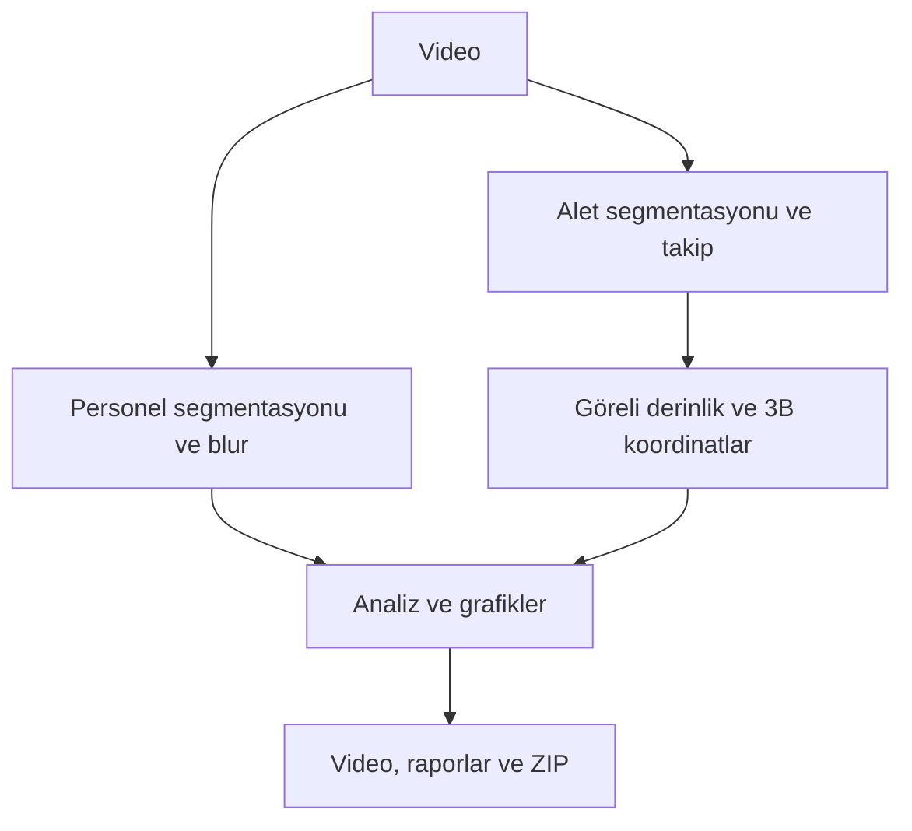

# Cerrahi Video Analitiği

Cerrahi videolardaki sağlık personelini otomatik olarak anonimleştiren, cerrahi aletleri takip eden ve analiz sonuçlarını indirilebilir raporlara dönüştüren yerel masaüstü uygulaması.

Videonuzu arayüze sürükleyip bırakın, **Analizi Başlat** düğmesine basın ve işlem tamamlandığında:

- anonimleştirilmiş analiz videosunu,
- alet kullanım sürelerini,
- sağlık personeli sayısının zaman içindeki değişimini,
- aletlerin göreli 2B ve 3B hareket sonuçlarını,
- CSV, JSON, PNG, HTML ve ZIP raporlarını

tek ekrandan görüntüleyip indirin.

> [!IMPORTANT]
> Bu yazılım klinik karar destek aracı değildir. Kimliksizleştirme ve nesne tespiti model tabanlıdır; sonuçlar paylaşılmadan önce insan tarafından kontrol edilmelidir.

## İçindekiler

- [Neler yapar?](#neler-yapar)
- [Sistem gereksinimleri](#sistem-gereksinimleri)
- [Hızlı başlangıç](#hızlı-başlangıç)
- [Model ağırlıkları](#model-ağırlıkları)
- [Arayüzden kullanım](#arayüzden-kullanım)
- [Sonuçlar](#sonuçlar)
- [Sonuçları doğru yorumlama](#sonuçları-doğru-yorumlama)
- [Komut satırından kullanım](#komut-satırından-kullanım)
- [Sorun giderme](#sorun-giderme)
- [Gizlilik](#gizlilik)
- [Geliştiriciler için](#geliştiriciler-için)
- [Lisans ve sınırlamalar](#lisans-ve-sınırlamalar)

## Neler yapar?

### Sağlık personelini anonimleştirir

- Yalnızca sağlık personeli sınıfına ait segmentasyon maskelerini blurlaştırır.
- Maskelerin kenarlarını genişletip yumuşatarak daha güvenli bir anonimleştirme alanı oluşturur.
- Kısa süreli algılama kayıplarında maske devamlılığını korumaya çalışır.
- Videoda kişi kutusu, kimlik numarası veya sınıf etiketi göstermez.
- Ekranda yalnızca o anda takip edilen toplam kişi sayısını gösterir: `Sağlık personeli: N`.

### Cerrahi aletleri analiz eder

- Aletleri segmentasyon modeliyle tespit eder ve video boyunca takip eder.
- Videoda kutu, maske, güven skoru veya takip numarası göstermez; yalnızca alet adını yazar.
- Kısa algılama kesintilerini birleştirerek aletlerin görünürlük tabanlı kullanım aralıklarını hesaplar.
- Aynı sınıftaki birden fazla aleti ayrı ayrı takip eder.

### Rapor ve grafik üretir

- Alet sınıfı başına kullanım süresi
- Toplam örnek-zamanı (`instance-time`)
- Sağlık personeli sayısı zaman çizelgesi
- Göreli 2B ve 3B hareket uzunlukları
- Etkileşimli göreli 3B yörünge grafiği
- Makine tarafından okunabilir CSV ve JSON kayıtları
- Tek dosyada indirilebilir sonuç paketi

## Sistem gereksinimleri

### Önerilen

- Windows 10/11 veya güncel bir Linux dağıtımı
- Python 3.11
- NVIDIA CUDA destekli ekran kartı
- En az 16 GB RAM
- FFmpeg
- İlk kurulum ve model indirme işlemleri için internet bağlantısı

NVIDIA GPU işlemi önemli ölçüde hızlandırır. CUDA bulunmadığında uygulama CPU üzerinde çalışabilir; ancak iki segmentasyon modeli ve derinlik modeli nedeniyle işlem çok daha uzun sürebilir.

> [!TIP]
> Uzun veya yüksek çözünürlüklü videolar için yeterli boş disk alanı bırakın. İşlenmiş video, grafikler ve ara analiz kayıtları kaynak videonun boyutuna bağlı olarak ek alan kullanır.

## Hızlı başlangıç

Önce projeyi GitHub'daki **Code → Download ZIP** seçeneğiyle indirin veya Git ile klonlayın. Arşiv indirdiyseniz çıkartın ve PowerShell/Terminal'i proje klasöründe açın.

### Windows kurulumu

İlk kurulumda:

```powershell
powershell -ExecutionPolicy Bypass -File .\scripts\setup_windows.ps1
```

Kurulum tamamlandıktan sonra uygulamayı başlatın:

```powershell
powershell -ExecutionPolicy Bypass -File .\scripts\start_windows.ps1
```

Sonraki kullanımlarda yalnızca başlatma komutu yeterlidir:

```powershell
powershell -ExecutionPolicy Bypass -File .\scripts\start_windows.ps1
```

### Linux kurulumu

İlk kurulumda:

```bash
bash scripts/setup_linux.sh
```

Uygulamayı başlatmak için:

```bash
bash scripts/start_linux.sh
```

Başlatma tamamlandığında arayüz tarayıcıda yerel bir adreste açılır. Uygulama varsayılan olarak yalnızca `127.0.0.1` üzerinde çalışır; video için dış ağ paylaşım bağlantısı oluşturmaz.

## Model ağırlıkları

Uygulama iki model kullanır:

| Model | Dosya | Görevi |
| --- | --- | --- |
| Sağlık personeli modeli | `health_personnel_segmentation.pt` | Personel segmentasyonu ve anonimleştirme |
| Cerrahi alet modeli | `surgical_instrument_segmentation.pt` | Alet segmentasyonu ve takibi |

### Otomatik model kurulumu

Model dosyaları Git deposunun içine gömülmez; sürümlü GitHub Release dosyaları olarak dağıtılır. Kurulum veya ilk başlatma sırasında eksik modeller otomatik indirilir.

İndirme tamamlandığında uygulama:

1. dosyanın SHA-256 özetini doğrular,
2. modelin açılabildiğini kontrol eder,
3. model görevini ve sınıf listesini doğrular,
4. yalnızca bütün kontroller başarılıysa analize izin verir.

Modelleri elle kontrol etmek veya yeniden indirmek için:

```powershell
python -m surgical_pipeline models list
python -m surgical_pipeline models download
python -m surgical_pipeline models verify
python -m surgical_pipeline models redownload
```

### Manuel veya çevrimdışı kurulum

Model dosyalarını release sayfasından başka bir bilgisayarda indirip aşağıdaki klasöre kopyalayabilirsiniz:

```text
models/weights/
├── health_personnel_segmentation.pt
└── surgical_instrument_segmentation.pt
```

Ardından doğrulama yapın:

```powershell
python -m surgical_pipeline models verify
```

### Kendi modelinizi kullanma

`.env.example` dosyasını `.env` adıyla kopyalayın ve model yollarını yazın:

```env
HEALTH_MODEL_PATH=C:/models/health_best.pt
INSTRUMENT_MODEL_PATH=C:/models/instrument_best.pt
```

Uygulama model yollarını şu sırayla çözer:

1. Komut satırında verilen model yolu
2. `.env` içinde belirtilen model yolu
3. `models/weights/` içindeki doğrulanmış modeller
4. GitHub Releases üzerinden otomatik indirme

Sağlık personeli sınıfı modelin metadata bilgisinden bulunur; sınıf numarası sabit kabul edilmez. Desteklenen varsayılan adlar:

```text
health_personel
health_personnel
health_person
healthcare_personnel
```

Uyumlu sınıf bulunamazsa uygulama analizi başlatmaz ve modelde bulunan sınıfları gösterir.

## Arayüzden kullanım

1. Başlatma betiğini çalıştırın.
2. Açılan sayfaya analiz edilecek videoyu sürükleyip bırakın.
3. Model ve donanım durumlarının **Hazır** olduğunu kontrol edin.
4. Gerekirse blur seviyesi, confidence, IoU, tracker ve derinlik örnekleme ayarlarını değiştirin.
5. **Analizi Başlat** düğmesine basın.
6. İlerleme çubuğundan işlenen kare sayısını ve tahmini kalan süreyi takip edin.
7. İşlem bittiğinde sonuç sekmelerini inceleyin.
8. İşlenmiş videoyu veya `results.zip` paketini indirin.

Aynı anda yalnızca bir video analiz edilir. **İptal Et** düğmesi mevcut karenin tamamlanmasının ardından işlemi güvenli biçimde durdurur. Kaynak video hiçbir zaman silinmez veya üzerine yazılmaz.

### Temel ayarlar

| Ayar | Açıklama |
| --- | --- |
| Blur seviyesi | Personel maskesine uygulanacak anonimleştirme gücü |
| Confidence | Düşük güvenli tespitlerin kabul sınırı |
| IoU | Örtüşen tespitlerin filtreleme eşiği |
| Tracker | BoT-SORT veya ByteTrack takip yöntemi |
| Depth stride | Derinlik modelinin kaç karede bir çalışacağını belirler |

Varsayılan değerler çoğu video için başlangıç noktasıdır. Eşikleri düşürmek daha fazla tespit üretirken yanlış pozitifleri de artırabilir.

### Alet adlarını değiştirme

Arayüzde gösterilen alet adları [configs/instrument_names.yaml](configs/instrument_names.yaml) dosyasından düzenlenebilir. Eşleme bulunmayan sınıflarda modelin özgün sınıf adı kullanılır.

## Sonuçlar

Her analiz ayrı bir klasöre kaydedilir:

```text
outputs/
└── run_YYYYMMDD_HHMMSS/
    ├── processed_video.mp4
    ├── analysis_report.html
    ├── summary.json
    ├── instrument_tracks.csv
    ├── health_person_count.csv
    ├── usage_intervals.csv
    ├── usage_duration_chart.png
    ├── relative_3d_motion_chart.png
    ├── health_person_count_chart.png
    ├── trajectories_3d.html
    ├── trajectories_3d.png
    ├── run_config.yaml
    ├── logs/
    └── results.zip
```

| Çıktı | İçerik |
| --- | --- |
| `processed_video.mp4` | Personelin anonimleştirildiği ve alet adlarının gösterildiği video |
| `analysis_report.html` | Tarayıcıda açılabilen genel analiz raporu |
| `summary.json` | Video, model, performans ve ölçüm özeti |
| `instrument_tracks.csv` | Kare/zaman bazlı alet takip kayıtları |
| `health_person_count.csv` | Zaman içindeki aktif personel sayısı |
| `usage_intervals.csv` | Alet kullanım aralıklarının başlangıç, bitiş ve süreleri |
| `usage_duration_chart.png` | Sınıf bazlı kullanım süresi grafiği |
| `relative_3d_motion_chart.png` | Göreli 3B hareket uzunluğu grafiği |
| `trajectories_3d.html` | Etkileşimli göreli 3B yörüngeler |
| `results.zip` | Paylaşılabilir toplu sonuç paketi |

Kaynak videoda ses varsa ve FFmpeg kullanılabiliyorsa ses işlenmiş videoya eklenir.

## Sonuçları doğru yorumlama

### Alet kullanım süresi

`union_usage_seconds`, belirli bir sınıftan en az bir doğrulanmış aletin videoda aktif olduğu zamanların birleşimidir. Aynı sınıftan iki alet aynı anda görünse bile bu süre iki katına çıkmaz.

`instance_time_seconds`, her ayrı alet track'inin süresini toplar. Aynı anda görünen iki ayrı alet bu değere ayrı ayrı katkıda bulunur.

Kısa tespit boşlukları yapılandırılmış sınırın altındaysa aynı kullanım aralığına birleştirilir. Bu değerler **modelin aleti videoda görünür olarak algıladığı süreyi** temsil eder; gerçek fiziksel kullanım süresi olarak yorumlanmamalıdır.

### Göreli 3B hareket

Tek RGB kameradan gerçek dünya ölçeğinde güvenilir 3B mesafe elde edilemez. Sistem, segmentasyon maskesi ile monoküler derinlik tahminini birleştirerek `(x, y, relative_depth)` noktaları üretir.

Bu nedenle çıktılar:

- **Göreli 3B yörünge**,
- **Relative 3D trajectory**,
- **Relative motion units**

olarak adlandırılır. Sonuçlar santimetre veya metre değildir; farklı videolar arasında doğrudan fiziksel mesafe karşılaştırması yapılmamalıdır.

## Komut satırından kullanım

Arayüz kullanmadan önce sistemi kontrol etmek için:

```powershell
python -m surgical_pipeline doctor
```

Bir videoyu doğrudan analiz etmek için:

```powershell
python -m surgical_pipeline analyze `
  --input "C:\path\video.mp4" `
  --output-dir "outputs"
```

Özel modellerle çalıştırmak için:

```powershell
python -m surgical_pipeline analyze `
  --input "C:\path\video.mp4" `
  --health-model "C:\models\health_best.pt" `
  --instrument-model "C:\models\instrument_best.pt" `
  --output-dir "outputs"
```

Desteklenen ek seçenekleri görmek için:

```powershell
python -m surgical_pipeline analyze --help
```

## Sorun giderme

### Uygulama başlamıyor

Önce sistem kontrolünü çalıştırın:

```powershell
python -m surgical_pipeline doctor
```

Çıktıda **FAIL** olarak gösterilen kritik kontrolleri düzeltmeden analiz başlamaz.

### Model indirilemiyor

- İnternet bağlantısını kontrol edin.
- Yarım kalan `.part` dosyası varsa `models redownload` komutunu çalıştırın.
- Otomatik indirme kullanılamıyorsa modelleri release sayfasından manuel indirip `models/weights/` klasörüne yerleştirin.
- Ardından `python -m surgical_pipeline models verify` komutunu çalıştırın.

### Model doğrulaması başarısız

- Dosya adlarının doğru olduğunu kontrol edin.
- Model dosyasını yeniden indirin.
- Kendi modelinizi kullanıyorsanız `.env` yollarını ve modelin `segment` görevinde olduğunu kontrol edin.
- Sağlık modelinde desteklenen sağlık personeli sınıflarından en az biri bulunmalıdır.

### CUDA kullanılamıyor

- `nvidia-smi` komutunun çalıştığını kontrol edin.
- NVIDIA sürücüsünü güncelleyin.
- Kurulu PyTorch sürümünün CUDA desteğini kontrol edin:

```powershell
python -c "import torch; print(torch.cuda.is_available()); print(torch.cuda.get_device_name(0) if torch.cuda.is_available() else 'CPU')"
```

CUDA kullanılamazsa uygulama CPU modunda çalışabilir, ancak işlem süresi uzar.

### FFmpeg bulunamıyor veya çıktı videosunda ses yok

FFmpeg'in kurulu ve `PATH` değişkeninde olduğunu doğrulayın:

```powershell
ffmpeg -version
```

FFmpeg olmadan analiz devam edebilir; ancak H.264 kodlama veya kaynak sesin çıktıya eklenmesi sınırlanabilir.

### İlk 3B analiz yavaş

Derinlik modeli ilk kullanımda indirilebilir ve yerel cache'e alınabilir. Sonraki çalıştırmalar daha hızlı başlar. Daha hızlı analiz için arayüzdeki `Depth stride` değerini artırabilir veya göreli 3B analizi kapatabilirsiniz.

### Anonimleştirme bir kişiyi kaçırdı

Bu, modelin görüş açısı, örtüşme, ışık veya eğitim verisi sınırları nedeniyle oluşabilir. Videoyu paylaşmayın; blur ayarını artırarak yeniden işleyin ve sonucu manuel olarak kontrol edin. Modelin kaçırdığı personeli yazılım tek başına garanti edemez.

## Gizlilik

- Video analizi yerel bilgisayarda gerçekleştirilir.
- Gradio paylaşım bağlantısı oluşturulmaz.
- Kaynak video değiştirilmez veya silinmez.
- Raporlara mutlak yerel dosya yolu ya da kullanıcı adı yazılmaz.
- Model/depth indirme istekleri dışında video içeriğinin dış servislere gönderilmesi amaçlanmaz.
- Kaynak ve işlenmiş videolar, sonuç ZIP'i ve loglar yine de hassas veri içerebilir.

Sonuçları başka biriyle paylaşmadan önce anonimleştirilmiş videoyu baştan sona izleyin ve kurumunuzun KVKK/GDPR, etik kurul ve bilgi güvenliği kurallarına uyun.

## Sistem mimarisi



Temel teknolojiler: Python 3.11, PyTorch, Ultralytics YOLO, OpenCV, Gradio Blocks, NumPy, pandas, Plotly, Matplotlib, PyYAML, Pydantic, FFmpeg ve pytest. Göreli derinlik için lisansı dağıtım öncesinde doğrulanmış Depth Anything V2 Small veya yapılandırılmış eşdeğer model kullanılır.

## Geliştiriciler için

Testleri çalıştırmak için:

```powershell
python -m pytest -v
python -m ruff check .
python -m surgical_pipeline doctor
```

Public katkı veya hata bildirimi yapmadan önce [CONTRIBUTING.md](CONTRIBUTING.md) ve [SECURITY.md](SECURITY.md) dosyalarını inceleyin.

Model, video, `.env`, çıktı veya diğer hassas dosyaları commit etmeyin. Bunlar `.gitignore` kapsamındadır. Model ağırlıkları normal Git geçmişi yerine, dağıtım ve eğitim verisi izinleri doğrulandıktan sonra sürümlü release dosyaları olarak sunulur.

## Lisans ve sınırlamalar

Proje kodunun lisansı [LICENSE](LICENSE) dosyasında belirtilir. Model ağırlıkları ve üçüncü taraf bağımlılıklar kendi lisans koşullarına tabidir; ayrıntılar için [THIRD_PARTY_NOTICES.md](THIRD_PARTY_NOTICES.md) dosyasına bakın.

Bilinen temel sınırlamalar:

- Tespit ve takip doğruluğu eğitim verisi, ışık, kamera açısı ve örtüşmeye bağlıdır.
- Model tabanlı anonimleştirme hata yapabilir ve manuel kalite kontrol gerektirir.
- Monoküler derinlik metrik 3B ölçüm değildir.
- Çok uzun/yüksek çözünürlüklü videolar önemli GPU zamanı ve disk alanı kullanabilir.
- Değişken kare hızlı videolarda çıktı, video okuyucunun erişebildiği zaman bilgisiyle sınırlıdır.

---

Bir hata bildirirken hassas video, hasta bilgisi, model ağırlığı veya kişisel dosya yolu paylaşmayın. Teknik hata için mümkünse `doctor` çıktısının kişisel bilgi içermeyen bölümünü ekleyin.
